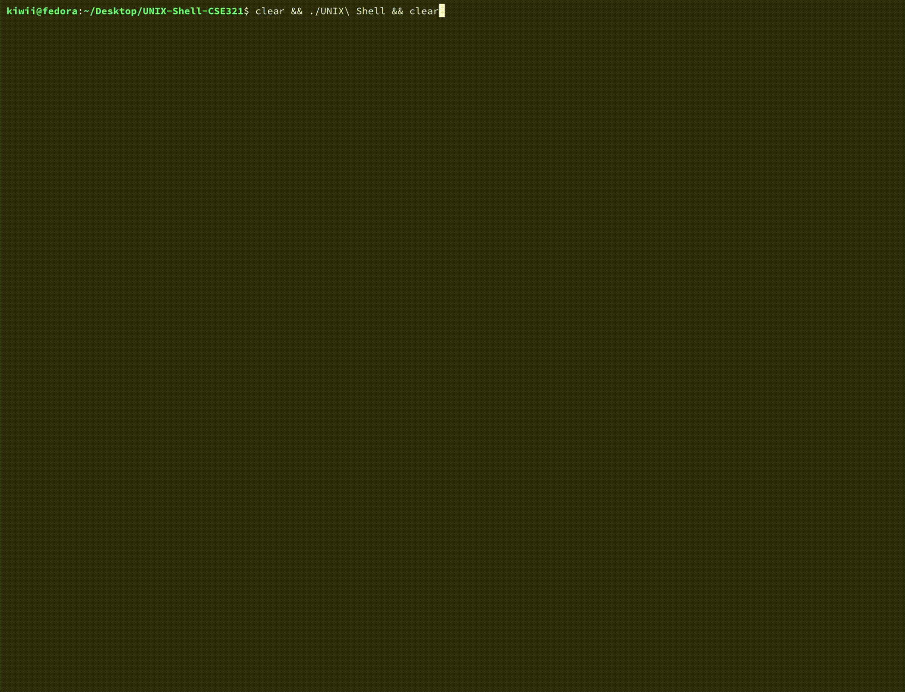

# **UNIX Shell Project**  

**Hello World! Welcome to our UNIX Shell Project!**  

This project was developed as part of **BRACU CSE321 (Operating Systems) Lab**.  
## **Preview**

## **Group Members**  
We are grateful to have had an amazing team:  
- **Al Saihan Tajvi**  
- **Farhan Zarif**
- **Sadik Mina Dweep** 

## **Implemented Features**  

### **Al Saihan Tajvi**  
- Displaying a command prompt (e.g., `sh>`) and reading user input.  
- Parsing and executing system commands using `fork()` and `exec()`.  
- Supporting multiple in-line commands separated by semicolons (`;`).  
- Supporting sequential command execution using logical AND (`&&`).  

### **Farhan Zarif**  
- Implementing input (`<`) and output (`>`, `>>`) redirection using `dup()` and `dup2()`.  
- Enabling command piping (`|`) for any number of pipes.  

### **Sadik Mina Dweep**  
- Signal handling (`CTRL+C`) using `signal()` and `sigaction()` to terminate running commands without exiting the shell.  
- Maintaining and supporting a history of executed commands.  

---

It was an incredible experience collaborating on this project with both Farhan And Sadik. Below are their GitHub profiles for reference:  
- **Farhan Zarif**: [Click!](https://github.com/zarif2042?fbclid=IwZXh0bgNhZW0CMTAAAR4hRw39dGF8HW2SRk5acEdkLN30ryruRy7fSSGYi4XQ6UZ3OYT8BhzTQcwR7Q_aem_TdW2s0q6NPpm5MnPkDbaYg) 
- **Sadik Mina Dweep**: [Click!](https://github.com/sadikmina?fbclid=IwY2xjawJrG4hleHRuA2FlbQIxMAABHt55GURpnq0qgkkq0Hptj_bDP6fSsCrYDSgCaIQcUoam1l1Hk4lhRNX1lsMJ_aem_-TRUyDXohc048WlaZvd2mA) 
