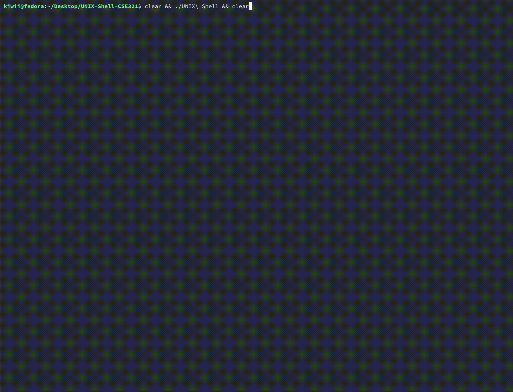

# 🐚 UNIX Shell Project

> A custom UNIX shell implementation built from scratch in C as part of **BRACU CSE321 (Operating Systems) Lab**.



---

## 📋 Table of Contents

- [Features](#-features)
- [Getting Started](#-getting-started)
- [Usage](#-usage)
- [Built-in Commands](#-built-in-commands)
- [Team Members](#-team-members)
- [Contributions](#-contributions)

---

## ✨ Features

| Feature | Description |
|---------|-------------|
| **Command Prompt** | Interactive shell prompt (`UNIX Shell >`) for user input |
| **Command Execution** | Parse and execute system commands using `fork()` and `exec()` |
| **Multiple Commands** | Execute multiple commands inline using semicolon (`;`) separator |
| **Logical AND** | Sequential command execution with `&&` (stops on failure) |
| **Input Redirection** | Redirect input from files using `<` operator |
| **Output Redirection** | Redirect output to files using `>` (overwrite) or `>>` (append) |
| **Piping** | Chain commands with `\|` for unlimited pipe operations |
| **Signal Handling** | Graceful `CTRL+C` handling without shell termination |
| **Command History** | Maintains history of last 20 executed commands |

---

## 🚀 Getting Started

### Prerequisites

- GCC compiler
- Linux/Unix environment (or WSL on Windows)

### Compilation

```bash
gcc -o shell "UNIX Shell.c"
```

### Running the Shell

```bash
./shell
```

Or use the provided script:

```bash
./run-shell
```

---

## 💻 Usage

### Basic Commands

```bash
UNIX Shell > ls -la
UNIX Shell > pwd
UNIX Shell > echo "Hello World"
```

### Multiple Commands with Semicolon

```bash
UNIX Shell > ls ; pwd ; whoami
```

### Sequential Execution with AND

```bash
UNIX Shell > mkdir test && cd test && touch file.txt
```

### Input/Output Redirection

```bash
UNIX Shell > cat < input.txt
UNIX Shell > ls -la > output.txt
UNIX Shell > echo "append this" >> output.txt
```

### Piping Commands

```bash
UNIX Shell > ls -la | grep ".c"
UNIX Shell > cat file.txt | sort | uniq
UNIX Shell > ps aux | grep bash | head -5
```

---

## 📌 Built-in Commands

| Command | Description |
|---------|-------------|
| `cd [dir]` | Change directory (defaults to `$HOME` if no argument) |
| `history` | Display command history (last 20 commands) |
| `ABOUT` | Show program details and contributor information |
| `EXIT` | Terminate the shell gracefully |

---

## 👥 Team Members

| Name | Student ID | GitHub |
|------|------------|--------|
| **Al Saihan Tajvi** | 23301219 | — |
| **Farhan Zarif** | 23301692 | [@Faustus-Faber](https://github.com/Faustus-Faber) |
| **Sadik Mina Dweep** | 22101837 | [@sadikmina](https://github.com/sadikmina) |

---

## 🛠 Contributions

### Al Saihan Tajvi
- ✅ Command prompt display and user input handling
- ✅ Command parsing and execution using `fork()` and `exec()` system calls
- ✅ Multiple inline commands with semicolon (`;`) separator
- ✅ Sequential command execution with logical AND (`&&`)

### Farhan Zarif
- ✅ Input redirection (`<`) using `dup()` and `dup2()`
- ✅ Output redirection (`>`, `>>`) using `dup()` and `dup2()`
- ✅ Command piping (`|`) supporting unlimited pipes

### Sadik Mina Dweep
- ✅ Signal handling (`CTRL+C`) using `signal()` and `sigaction()`
- ✅ Command history maintenance and display

---

## 📄 License

This project was developed for educational purposes as part of the CSE321 Operating Systems course at BRAC University.

---

<p align="center">
  <i>It was an incredible experience collaborating on this project! 🚀</i>
</p> 
